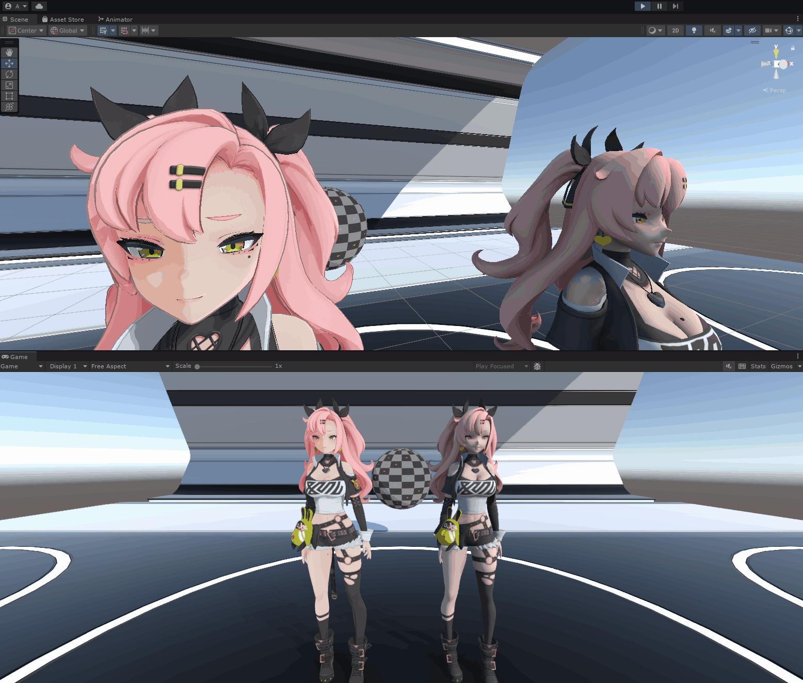

  <!--  -->
  
  
  <!--  -->
  
  

  🌍
  <a href="./README.md">中文</a> |
  <a href="./README_EN.md">English</a> |
  日本語

  📥
  <a href="#-クイックスタート">クイックスタート</a> |
  <a href="#-機能">機能一覧</a>

# BlurToonURP - アニメ調トゥーンレンダリング Shader
これは `Unity 2022.3 LTS(URP 14.x)` の `URP` レンダーパイプラインで開発した `NPR` アニメ調トゥーンレンダリング Shader プロジェクトである。  
汎用的なアニメ調トゥーンレンダリングの表現を実装しており、基本設定、シェードステップ、ハイライト、アウトライン、リムライト、エミッシブ、マットキャップ、ライト設定といった一通りの機能を網羅している。  
MIT ライセンスを採用しているため、自由に利用できる。  

## 📜 目次
- [💻 動作環境](#-動作環境)
- [🌱 クイックスタート](#-クイックスタート)
- [✨ 機能](#-機能)
  - [Basic 基本設定](#basic-基本設定)
    - [RenderQueue レンダーキュー](#renderqueue-レンダーキュー)
    - [Clip クリップ（ディゾルブ）](#clip-クリップディゾルブ)
    - [Stencil ステンシルテスト](#stencil-ステンシルテスト)
  - [Base Map ベースマップ](#base-map-ベースマップ)
    - [Diffuse Type 拡散反射のグラデーション方式](#diffuse-type-拡散反射のグラデーション方式)
    - [Bright Shade Step シェードステップ](#bright-shade-step-シェードステップ)
    - [Shade Threshold Map シェード閾値マップ](#shade-threshold-map-シェード閾値マップ)
  - [Normal Map ノーマルマップ](#normal-map-ノーマルマップ)
  - [HighLight ハイライト](#highlight-ハイライト)
    - [Mask Map マスクマップ](#mask-map-マスクマップ)
  - [Outline アウトライン](#outline-アウトライン)
  - [Rim Light リムライト](#rim-light-リムライト)
    - [Rim Light Type リムライト検出方式](#rim-light-type-リムライト検出方式)
    - [Shade Mask シェードマスク](#shade-mask-シェードマスク)
    - [Mask Map マスクマップ](#mask-map-マスクマップ-1)
  - [Emissive エミッシブ](#emissive-エミッシブ)
    - [Emissive Animation エミッシブアニメーション](#emissive-animation-エミッシブアニメーション)
  - [MatCap マットキャップ](#matcap-マットキャップ)
    - [Mask Map マスクマップ](#mask-map-マスクマップ-2)
  - [Light Setting ライト設定](#light-setting-ライト設定)
  - [レンダリング Pass の説明](#レンダリング-pass-の説明)
  - [Debug デバッグ](#debug-デバッグ)
  - [Tools ツール](#tools-ツール)

## 💻 動作環境
| 項目 | バージョン |
| :-- | :-- |
| Unity | `2022.3.62f3 LTS` |
| URP (Universal RP) | `14.0.12`（`manifest.json` では 12.1.12 と宣言しているが、Unity 2022.3 では実際に 14.0.12 として解決される） |
| レンダーパイプライン | Universal Render Pipeline |
| ライセンス | MIT |

## 🌱 クイックスタート
1. `Unity 2022.3 LTS` でプロジェクトを開き、`URP` レンダーパイプラインが有効になっていることを確認する。  
2. 新しいマテリアルを作成し、Shader を `BlurToonURP/Lit` に切り替える。  
3. マテリアルの `Inspector` パネルで、専用のエディター UI の折りたたみパネルから各効果を調整する。  
4. サンプルアセット：
   - サンプルマテリアル：`Assets/PluginsDeveloper/BlurToonURP/Example/Materials/Lit.mat`
   - サンプルプレハブ：`Assets/PluginsDeveloper/BlurToonURP/Example/Prefabs/Sphere.prefab`

Shader とエディターのソースコードの場所：  
- Shader：`Assets/PluginsDeveloper/BlurToonURP/Core/Shaders/Lit.shader`
- マテリアルプロパティのバッファ：`Assets/PluginsDeveloper/BlurToonURP/Core/Shaders/LitInput.hlsl`
- 汎用関数ライブラリ：`Assets/PluginsDeveloper/BlurToonURP/Core/Shaders/BlurFunction.hlsl`
- シャドウ関数ライブラリ：`Assets/PluginsDeveloper/BlurToonURP/Core/Shaders/ShadowFunction.hlsl`
- エディター UI：`Assets/PluginsDeveloper/BlurToonURP/Core/Editor/ShaderGUILit.cs`
- ツールスクリプト：`Assets/PluginsDeveloper/BlurToonURP/Core/Tools/LightController.cs`

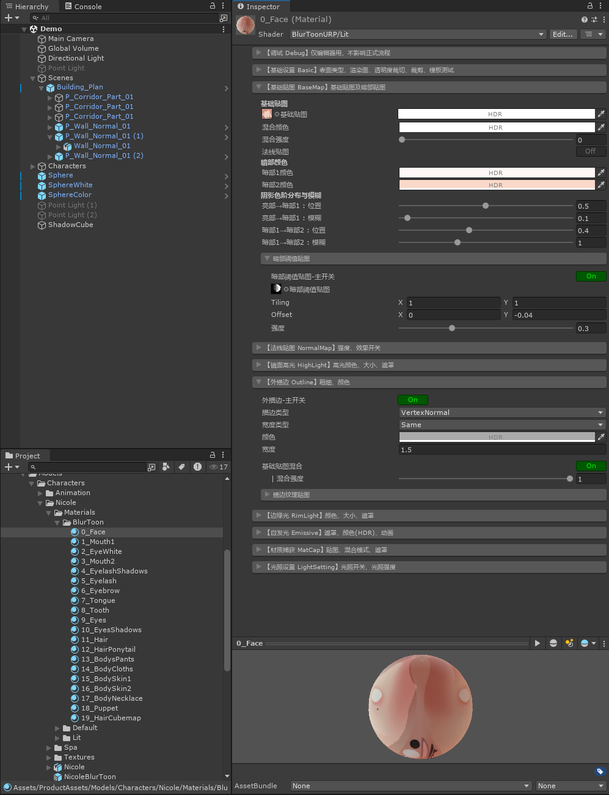

## ✨ 機能
---
機能のコードは `クリーンなコード` と `高いパフォーマンス` を心がけて実装している。充実した `コードコメント` により、Shader ファイルを直接読んでもコード全体の処理の流れをすばやく理解できる。  
あわせて専用の `Inspector エディター UI` も開発しており、クリエイターがより手軽に効果を調整できるようにしている。  
以下の各機能の見出しは、マテリアルのエディター UI の折りたたみパネルと 1 対 1 で対応している。  

> ⚠ エディター上の Inspector UI は現在中国語のみです。以下の表のラベルは訳語であり、正確な対応は **プロパティ** 列で確認してください。

> レンダーパイプラインは 5 つの Pass で構成される：`ForwardLit`（基本ライティング描画）、`ShadowCaster`（シャドウ投射）、`DepthOnly`（深度）、`DepthNormals`（深度ノーマル）、`Outline`（アウトライン）。

> すべてのマテリアルプロパティは `LitInput.hlsl` の `UnityPerMaterial` 定数バッファにまとめて宣言し、全 Pass が共通で `include` する。これにより各 Pass のレイアウトがバイト単位で一致し、`SRP Batcher` との互換性が保証される。

---

### Basic 基本設定
`【基础设置 Basic】表面类型、渲染面、透明度裁切、裁剪、模板测试`

マテリアルの基本的なレンダリングステートを一元管理する。`サーフェスタイプ` を切り替えると、エディターが対応するブレンド係数、深度書き込み、レンダーキュー、`RenderType` タグを自動で設定する。  
アルファクリップは `ForwardLit / Outline / ShadowCaster / DepthOnly / DepthNormals` の全 Pass に適用されるため、くり抜かれたシルエットは**シャドウ投射、深度テクスチャ、SSAO 用ノーマル**のいずれでも本体と一致する。  

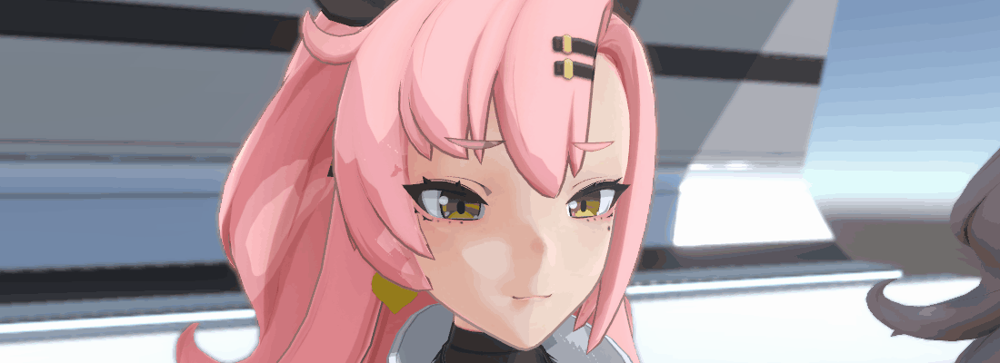

| パラメーター | プロパティ | 説明 |
| :-- | :-- | :-- |
| サーフェスタイプ | `_Surface`（→ `_SrcBlend` / `_DstBlend` / `_ZWrite` / レンダーキュー / `RenderType` を自動設定） | `Opaque` 不透明（`One/Zero`、深度書き込みあり）/ `Transparent` 半透明（標準的なアルファブレンド、深度書き込みなし、Transparent キュー） |
| レンダリング面 | `_IntRenderFaceType`（→ `Cull [_IntRenderFaceType]`） | `Both` 両面（Cull Off）/ `Back` 裏面（Cull Front）/ `Front` 表面（Cull Back、デフォルト） |
| アルファクリップ | `_ToggleAlphaClip` → `_ALPHATEST_ON` | 有効にすると `ベースマップのAlpha × ベースカラーのAlpha` でピクセルをクリップする（Cutout） |
| クリップ閾値 | `_Cutoff` | Alpha がこの値を下回るピクセルを破棄する |

> 補足：半透明は**標準的なアルファブレンド**のみを提供する（Premultiply/Additive/Multiply といった複数モードは含まない）。  
> `レンダリング面` は `ForwardLit / ShadowCaster / DepthOnly / DepthNormals` に作用する。`Outline` Pass はアウトラインの原理上 `Cull Front` 固定であり（背面を描画することでアウトラインを作るため）、この項目の影響を受けない。  
> アウトライン Pass のブレンドは独立しており（`SrcAlpha OneMinusSrcAlpha`）、サーフェスタイプの切り替えに追従しない。これによりアウトラインが常に安定して見えるようにしている。  

#### RenderQueue レンダーキュー
`レンダーキュー自動` を有効にすると、エディターが `サーフェスタイプ / アルファクリップ / ステンシルタイプ` からキューを導出する。無効にすると手動で指定できる（複数選択して編集した場合は選択中の全マテリアルに適用される）。  

| パラメーター | プロパティ | 説明 |
| :-- | :-- | :-- |
| レンダーキュー自動 | `_ToggleRenderQueueAuto` | オン（デフォルト）= 自動導出 / オフ = 手動設定したキューを保持し、エディターは上書きしない |
| レンダーキュー | `Material.renderQueue` | 自動をオフにしたときのみ編集できる |

自動導出のルール：

| 条件 | キュー |
| :-- | :-- |
| サーフェスタイプ = `Transparent` | `Transparent`（3000） |
| ステンシルタイプ = `Reserve` 保持 | `AlphaTest - 1`（2449、マスクを書き込むため `Discard` より先に描画する） |
| ステンシルタイプ = `Discard` 破棄 | `AlphaTest`（2450） |
| アルファクリップが有効 | `AlphaTest`（2450） |
| その他（不透明） | `Geometry`（2000） |

#### Clip クリップ（ディゾルブ）
クリップマスクテクスチャの `R` チャンネルから強度をサンプリングし、くり抜きによるカリングやアルファのディゾルブフェードを実現する。上記の `アルファクリップ` とは**完全に独立**しており、併用できる。  

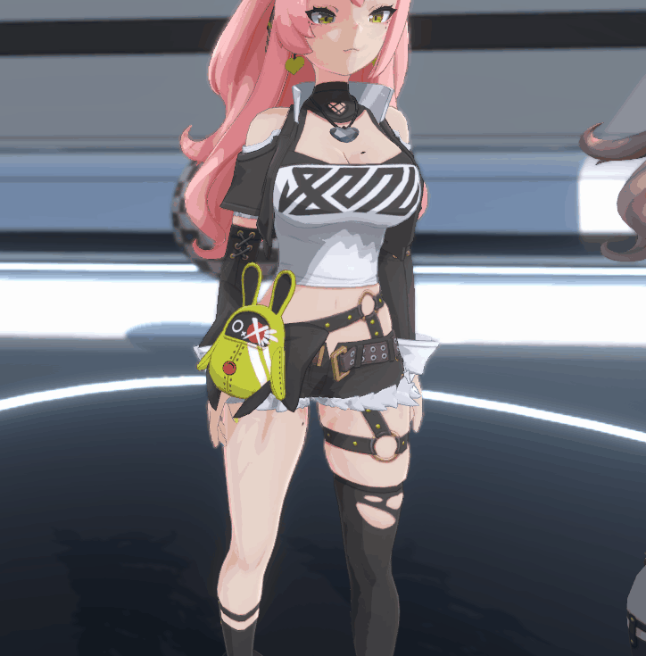

| パラメーター | プロパティ | 説明 |
| :-- | :-- | :-- |
| クリップタイプ | `_IntClipType` → `_CLIP_DITHER` / `_CLIP_ALPHA`（キーワードなし = 無効） | `Off` 無効 / `Dither` くり抜き / `Alpha` 透過 |
| クリップテクスチャ | `_TexClipMaskMap` | R チャンネルをクリップ強度（0-1）としてサンプリングする。UV は独立してスケール・オフセットできる |
| クリップ強度 | `_FloatClipIntensity` | `Dither` のみ：この値を下回るピクセルを破棄する |
| 透過強度 | `_FloatClipTransIntensity` | `Alpha` のみ：範囲は `-1~1`。大きいほどディゾルブが進む |
| ベースマップのAチャンネルを有効化 | `_ToggleClipTransBaseMapAlpha` | `Alpha` のみ：ベースマップの Alpha をクリップ計算に乗算する |

> `Alpha` モードのクリップ値は最終 Alpha に書き込まれる（`alphaFinal = saturate(clipAlpha)`）ため、透過フェードを見るには `サーフェスタイプ` を `Transparent` にする必要がある。そうでない場合はハードなカリングとしてのみ表現される。  
> クリップは `ForwardLit` と `Outline` の 2 つの Pass で有効。`ShadowCaster / DepthOnly / DepthNormals` は**クリップの対象外**であり、ディゾルブした箇所も影を落とし、深度も書き込む。  
> `Outline` Pass のクリップは**ハードなカリング**（透過フェードなし）であり、`Alpha` モードではアウトラインは `マスク - 透過強度` のみで判定し、ベースマップの Alpha は乗算しない。  

#### Stencil ステンシルテスト
ステンシルバッファでマスク表現を実現する。**同じ `ステンシルグループ番号` を持つマテリアル同士のみが影響し合う**。代表的な用途は、服の下の体を透けさせない、髪を貫通して目を表示する、など。  

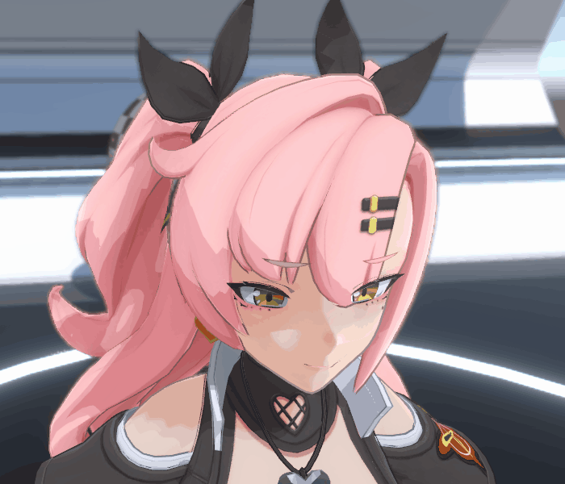

| パラメーター | プロパティ | 説明 |
| :-- | :-- | :-- |
| ステンシルタイプ | `_IntStencilType`（→ エディターが Comp/Pass/Fail をプリセット） | `Off` 無効 / `Discard` 破棄（同じグループのマスク部分を描画しない）/ `Reserve` 保持（マスクを書き込み、破棄より先に描画する） |
| ステンシルグループ番号 | `_FloatStencilNum`（`Ref`） | 番号が同じもの同士のみ影響し合う（0-255） |
| 比較関数 / 成功時の書き込み / 失敗時の書き込み | `_FloatStencilComp` / `_FloatStencilPass` / `_FloatStencilFail` | `ステンシルタイプ` から自動でプリセットされるため、手動設定は不要 |

プリセットの対応（値は `UnityEngine.Rendering.CompareFunction` / `StencilOp` に対応）：

| ステンシルタイプ | Comp | Pass | Fail |
| :-- | :-- | :-- | :-- |
| `Off` 無効 | `Disabled`(0) | `Keep`(0) | `Keep`(0) |
| `Discard` 破棄 | `NotEqual`(6) | `Keep`(0) | `Keep`(0) |
| `Reserve` 保持 | `Always`(8) | `Replace`(2) | `Replace`(2) |

> ステンシルテストは `ForwardLit` と `Outline` の 2 つの Pass に作用するため、アウトラインもあわせてマスク/書き込みの対象になる。  

---

### Base Map ベースマップ
`【基础贴图 BaseMap】基础贴图及暗部贴图`

ベースマップを主色とし、`ハーフランバート(Half-Lambert)` ライティングからシェードを求めて、トゥーン調の明暗レイヤーを構築する。  
シェードの**グラデーション生成方式**は 2 種類あり、`拡散反射のグラデーション方式` で二者択一する：`色段（ステップ）`（プログラマブルな 2 段階のシェード）と `Rampテクスチャ`（1 次元グラデーションによるソフトな変化）。両者は下流で共有される最終カラーとシェード係数を出力するため、同じ拡散反射処理に対する 2 つの実装であり、並列した独立機能ではない。  

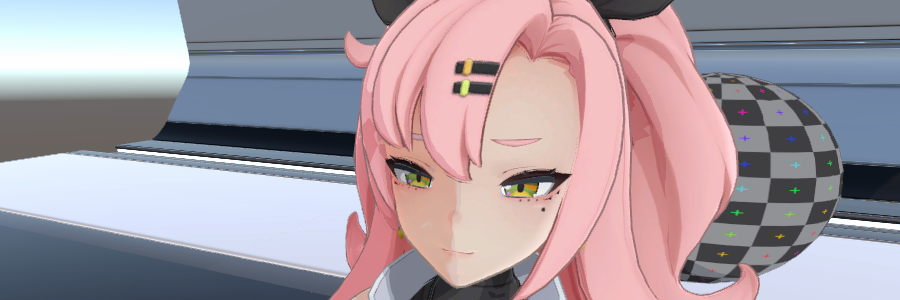

| パラメーター | プロパティ | 説明 |
| :-- | :-- | :-- |
| ベースマップ | `_BaseMap` | メインテクスチャ（sRGB） |
| ベースカラー | `_BaseColor` | テクスチャに乗算するカスタムカラー（HDR） |
| ブレンドカラー / ブレンド強度 | `_BaseMapBlendColor` / `_BaseMapBlendColorIntensity` | ベースカラーの上にカスタムカラーを重ねてブレンドする |
| ノーマルマップ | `_ToggleNormalMapOnBaseMap` | ベースマップの明暗計算にノーマルマップを使用する（先に【ノーマルマップ】パネルでテクスチャを指定しておく必要がある） |
| 拡散反射のグラデーション方式 | `_FloatDiffuseType` → `_BASEMAP_DIFFUSE_RAMP_ON` | `色段（ステップ）`（0、デフォルト）/ `Rampテクスチャ`（1）。下記【拡散反射のグラデーション方式】を参照 |
| シェード1カラー | `_Shade1Color` | 1 段目のシェードのカラー（`色段（ステップ）` 方式のみ） |
| シェード2カラー | `_Shade2Color` | 2 段目のシェードのカラー（`色段（ステップ）` 方式のみ） |

#### Diffuse Type 拡散反射のグラデーション方式
「ハーフランバート値 → 明暗カラー」というステップの生成方式を決める。切り替えるとエディターは対応する方式のパラメーターのみを表示するが、もう一方のパラメーターもマテリアル内に保持されるため失われない。  

| 方式 | キーワード | 原理 | 適する用途 |
| :-- | :-- | :-- | :-- |
| `色段（ステップ）`（デフォルト） | キーワードなし | プログラマブルな 2 段階の色段：`位置 / ぼかし` に従って明部・シェード1・シェード2 の 3 レイヤーのカラーを補間する | レイヤーが明確なトゥーンシェード。パラメーター調整のみで完結し、追加のテクスチャが不要 |
| `Rampテクスチャ` | `_BASEMAP_DIFFUSE_RAMP_ON` | ハーフランバート値を横方向の UV として 1 次元グラデーションテクスチャをサンプリングし（左=暗 右=明）、その結果をそのままベースカラーに乗算する | グラデーションの硬さや段の分かれ方をすべてテクスチャ内でアーティストが描けるため自由度が高い |

`Rampテクスチャ` 方式の専用パラメーター：  

| パラメーター | プロパティ | 説明 |
| :-- | :-- | :-- |
| Ramp グラデーションテクスチャ | `_TexDiffuseRamp` | 横方向のグラデーション（左=シェード 右=明部）。**デフォルトの白 = 暗くならない**（テクスチャ未指定時の安全なフォールバック） |
| 行の選択(V) | `_FloatDiffuseRampV` | 複数行のグラデーションアトラスから対象の行を選択する。1 行のみのテクスチャでは `0.5` を指定する |

> Ramp のサンプリングは Shader 内で `Clamp / Linear / LOD0` を強制しているため、テクスチャインポート設定の Wrap/Filter を変更する必要はない。Mipmap は無効にすることを推奨する。LOD0 を強制しているのは、明暗の境界でハーフランバートのスクリーン微分が大きくなり、ぼけた mip が選択されるのを避けるためである。  
> どちらの方式も `シャドウ受け` と `シェード閾値マップ` の影響を受ける——これらはハーフランバート値に作用するため、影は Ramp のサンプリング座標をグラデーションの暗い側へ押しやることになる。  
> `Rampテクスチャ` 方式では `シェード1/2 カラー` と `シェードステップ` のパラメーターは使用しない。下流（ハイライト / マットキャップの「シャドウマスク」）が必要とするシェード係数は、Ramp のサンプリング結果の Rec709 輝度から逆算され、色段方式と同じ経路を共有する。  

#### Bright Shade Step シェードステップ
> `色段（ステップ）` 方式でのみ有効。  

ハーフランバート値を基準に、`明部→シェード1` と `シェード1→シェード2` という 2 段階のグラデーションについて、境界の位置とフェザー（ぼかし）の度合いを制御する。これによりハードエッジなトゥーンシェードから柔らかいグラデーションシェードまでを表現できる。  

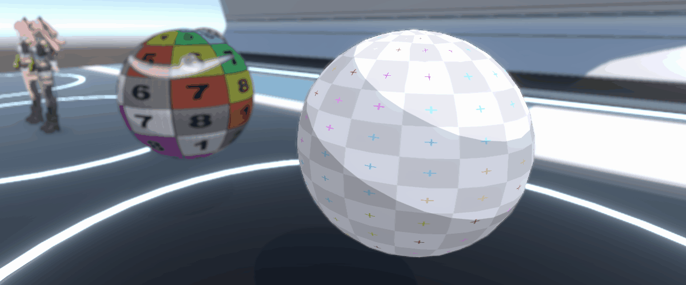

| パラメーター | プロパティ | 説明 |
| :-- | :-- | :-- |
| 明部→シェード1 : 位置 | `_FloatBrightShade1Step` | 1 段目の影の境界位置 |
| 明部→シェード1 : ぼかし | `_FloatBrightShade1Blur` | 1 段目の影のエッジのフェザー |
| シェード1→シェード2 : 位置 | `_FloatShade1Shade2Step` | 2 段目の影の境界位置 |
| シェード1→シェード2 : ぼかし | `_FloatShade1Shade2Blur` | 2 段目の影のエッジのフェザー |

> 色段のグラデーション帯には**スクリーンスペースのアンチエイリアス**を施している：`fwidth(halfLambert)` をグラデーション帯の最小幅として使い、遷移が最低でも約 1 ピクセルをカバーするようにしている。これにより、球体の輪郭、グレージング角、ローポリの面の境界など、ハーフランバートの勾配が急な箇所でもハードエッジのジャギーに潰れない。アーティストが設定したぼかしがそれより大きい場合はその値をそのまま使うため、見た目は変わらない。  

#### Shade Threshold Map シェード閾値マップ
> `色段（ステップ）` と `Rampテクスチャ` の両方式で共通。  

1 枚の閾値マップ（R チャンネルをサンプリング）でシェードの分布と強度を制御する。顔や皺など決まった領域に影の形状を手描きする用途に使える。  
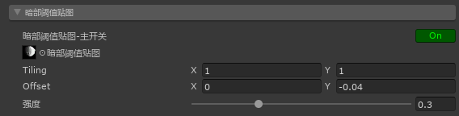

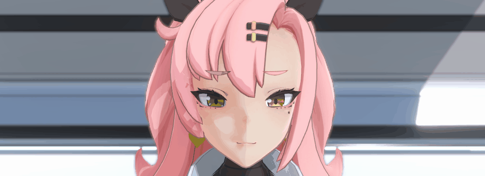

| パラメーター | プロパティ | 説明 |
| :-- | :-- | :-- |
| メインスイッチ | `_ToggleShadeThresholdMap` → `_BASEMAP_SHADE_THRESHOLDMAP_ON` | 閾値マップを有効にする |
| シェード閾値マップ | `_TexShadeThresholdMap` | 閾値マップ（linear） |
| 強度 | `_FloatShadeThresholdMapIntensity` | 閾値の影響強度 |

---

### Normal Map ノーマルマップ
`【法线贴图 NormalMap】贴图、强度、各效果生效状态`

タンジェント空間のノーマルマップをサンプリングしてワールド空間へ変換し、各効果が必要に応じて利用する。  

| パラメーター | プロパティ | 説明 |
| :-- | :-- | :-- |
| ノーマルマップ | `_BumpMap` | タンジェント空間のノーマルマップ（スケール・オフセット対応） |
| 強度 | `_BumpScale` | ノーマルの強度 |

**ノーマルの有効化スイッチはオブジェクト指向的な設計になっており、各効果のパネル内に分散している**。本パネルはノーマルマップ自体の指定と、各効果の適用状況の集約表示のみを担当する：  

| 効果 | スイッチの場所 | プロパティ |
| :-- | :-- | :-- |
| ベースマップ | 【ベースマップ】→ `ノーマルマップ` | `_ToggleNormalMapOnBaseMap` |
| ハイライト | 【ハイライト】→ `ノーマルマップ` | `_ToggleNormalMapOnHighLight` |
| マットキャップ | 【マットキャップ】→ `ノーマルマップ` | `_ToggleNormalMapOnMatCap` |
| エミッシブ | 【エミッシブ】→ `エミッシブアニメーション → 視点変化カラー → ノーマルマップ` | `_ToggleNormalMapOnEmissive` |
| リムライト | 【リムライト】→ `ノーマルの取得元`（ジオメトリノーマル / ノーマルマップ / ブレンド） | `_FloatRimLightNormalSource` |

本パネルの下部には、上記の各項目の現在の適用状況が**読み取り専用で一覧表示**される。「ノーマルのスイッチを入れたのに変化がない」原因が、テクスチャ未指定なのか、強度が 0 なのか、それとも効果自体の前提スイッチが入っていないのかを一目で判断できる。  

> ノーマルマップを指定していない状態で上記いずれかのスイッチを有効にすると、エディターはそのスイッチの下に**赤字で無効である旨を表示する**。  
> テクスチャ未指定、または `強度` が 0（サンプリング結果が平面ノーマルと等価）の場合も、本パネルに総合的な警告が表示される。  

---

### HighLight ハイライト
`【高光 HighLight】高光颜色、大小、遮罩`

`ノーマルとハーフベクトルのなす角(NdotH)` を基にトゥーン調のハイライトを計算する。ハイライトテクスチャ、カラー、強度、サイズ（範囲）、エッジのフェザーに対応し、ライトカラーへの追従やシャドウによるマスクも可能。  

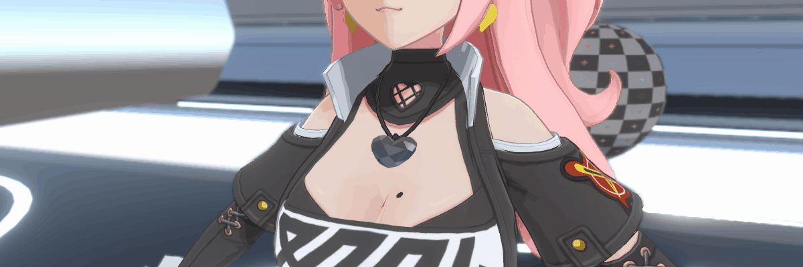

| パラメーター | プロパティ | 説明 |
| :-- | :-- | :-- |
| メインスイッチ | `_ToggleHighLight` → `_HIGHLIGHT_ON` | ハイライトを有効にする |
| ハイライトテクスチャ | `_TexHighLightMap` | ハイライトの基本色 = テクスチャRGB(sRGB) × カラー。デフォルトの白 = 単色ハイライト。テクスチャでカラフルなハイライトや模様入りのハイライトも作れる |
| カラー | `_ColorHighLightColor` | ハイライトのカラー（HDR、Alpha も強度に影響する） |
| 強度 | `_FloatHighLightIntensity` | ハイライトの強度 |
| サイズ | `_FloatHighLightSize` | ハイライトの範囲。`[0,1]` を反射のべき指数 `[512,4]` にマッピングしており、値が大きいほどハイライトも大きくなる |
| エッジのフェザー | `_FloatHighLightBlur` | ハイライトのエッジの硬さ。`0` ≈ 色段のようなハードエッジで、大きいほど柔らかくなり「色段↔ソフトエッジ」を連続的にカバーする |
| ノーマルマップ | `_ToggleNormalMapOnHighLight` | ハイライトの向きにノーマルマップを使用する |
| シャドウマスク / 強度 | `_ToggleHighLightShadowMask` / `_FloatHighLightShadowMaskIntensity` | シェード1の領域に応じてハイライトを暗くし、影の中に不自然なハイライトが出るのを防ぐ |

> `シャドウ受け` を有効にすると、ハイライト係数にシャドウの減衰が乗算される。つまり**実際に影が落ちている箇所にはハイライトが出ない**。  
> ハイライトの `ライトカラーの影響を受ける` 設定は `ライト設定 → ライトスイッチ → ハイライト`（`_ToggleGlobalLightHighLight`）で制御する。  
> `ライト設定 → ライト方向ロック → ハイライト`（`_ToggleLightHorLockHighLight`）でハイライトのライト方向を水平にロックできる。  

#### Mask Map マスクマップ
ベースマップと同じ UV のマスクテクスチャ（R チャンネルをサンプリング）で、ハイライトの分布と強度をピクセル単位で制御する。  

| パラメーター | プロパティ | 説明 |
| :-- | :-- | :-- |
| マスクテクスチャ | `_TexHighLightMaskMap` → `_HIGHLIGHT_MASKMAP_ON` | ハイライト用のマスクテクスチャ（テクスチャを指定すると自動的にキーワードが有効になる） |
| マスク強度 | `_FloatHighLightMaskMapIntensity` | マスクの影響強度 |

---

### Outline アウトライン
`【外描边 Outline】粗细、颜色`

独立した `Outline` Pass（`LightMode = SRPDefaultUnlit`）で、`Cull Front` により**表面をカリングし（＝背面のみを描画し）**、頂点をノーマル方向へ押し出すことでアウトラインを描く。複数のアウトライン方向の取得元と幅モードに対応する。  

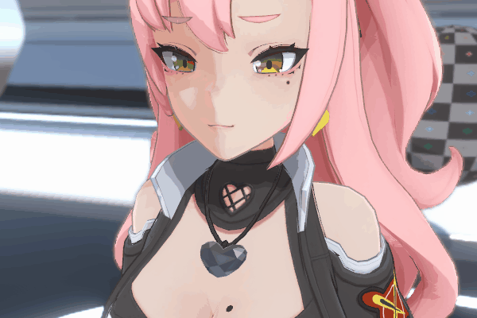

| パラメーター | プロパティ | 説明 |
| :-- | :-- | :-- |
| メインスイッチ | `_OUTLINE_ON`（Pass のスイッチ） | アウトラインを有効にする |
| アウトラインタイプ | `_FloatOutlineType` | アウトライン方向の取得元：`VertexNormal` / `VertexColor` / `VertexTangent` |
| 幅タイプ | `_FloatOutlineWidthType` → `_OUTLINE_WIDTH_SAME` / `_OUTLINE_WIDTH_SCALING` | `Same` 等幅（すべての頂点を同じ距離だけ押し出す）/ `Scaling` 可変幅（`dot(頂点方向, 押し出し方向) + 0.3` でスケールし、凸部は太く凹部は細くなる。頂点ごとに固定の値であり、**視点には依存しない**） |
| カラー | `_ColorOutlineColor` | アウトラインのカラー |
| 幅 | `_FloatOutlineWidth` | アウトラインの幅 |
| ベースマップとのブレンド / 強度 | `_ToggleOutlineBaseMapBlend` / `_FloatOutlineBaseMapBlendIntensity` | アウトラインのカラーをベースマップのカラーとブレンドし、より自然な見た目にする |
| アウトラインテクスチャ / 強度 | `_TexOutlineMap` → `_OUTLINE_MAP_ON` / `_FloatOutlineMapIntensity` | アウトライン専用のテクスチャでアウトラインのカラーを変調する（カラフルなアウトライン/模様/ノイズ）。テクスチャを指定すると自動的に有効になる |

> アウトラインの `ライトとシャドウの影響を受ける` 設定は `ライト設定 → ライトスイッチ → アウトライン`（`_ToggleGlobalLightOutline` / `_GlobalLightOutlineMixedIntensity`）で制御し、シャドウ部分は `シャドウ受け` のスイッチを共用する。  
> アウトラインは `アルファクリップ` と `クリップ Clip`、`ステンシルテスト Stencil`（【基本設定】パネルを参照）にも同時に対応する。ただし `Cull Front` 固定であり、`レンダリング面` の影響は受けない。  

---

### Rim Light リムライト
`【边缘光 RimLight】颜色、大小、遮罩`

オブジェクトの輪郭部分に発光するエッジを重ねる。強度、内側への広がり距離、ハードエッジの制御に対応する。  
エッジの**検出方式**は 2 種類（`フレネル` / `深度差`）から二者択一する。両者は同一のエッジ信号を出力する役割のみを担い、その後のカラー、強度、内側距離、ハードエッジ、シェードマスク、マスクテクスチャなどの処理は**完全に共通**である。  

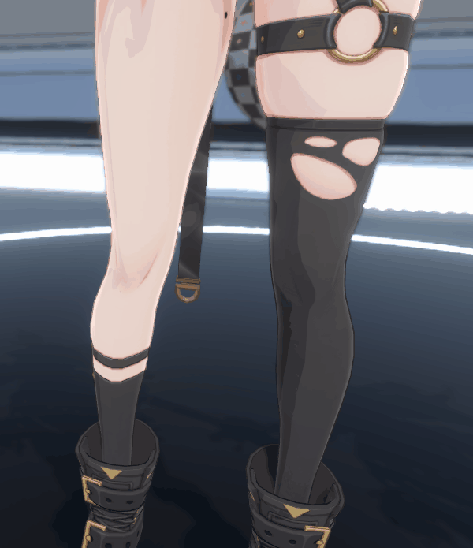

| パラメーター | プロパティ | 説明 |
| :-- | :-- | :-- |
| メインスイッチ | `_ToggleRimLight` → `_RIMLIGHT_ON` | リムライトを有効にする |
| カラー | `_ColorRimLightColor` | リムライトのカラー（HDR、Alpha で不透明度を制御する） |
| 強度 | `_FloatRimLightIntensity` | リムライトの範囲/強度 |
| 内側距離 | `_FloatRimLightInsideDistance` | リムライトが内側へ広がる距離。大きいほど範囲が狭くなる |
| ハードエッジ | `_ToggleRimLightHard` | エッジを硬くする（グラデーションを除去する） |
| 検出方式 | `_FloatRimLightType` → `_RIMLIGHT_DEPTH_ON` | `フレネル`（0、デフォルト）/ `深度差`（1）。下記【リムライト検出方式】を参照 |

#### Rim Light Type リムライト検出方式

| 方式 | キーワード | 原理 | 特徴 |
| :-- | :-- | :-- | :-- |
| `フレネル`（デフォルト） | キーワードなし | `ノーマルと視線のなす角(NdotV)` に基づき、グレージング角に近いほど明るくなる | 柔らかいグラデーションで、表面のノーマルのディテールに沿って起伏する。追加の依存なし |
| `深度差` | `_RIMLIGHT_DEPTH_ON` | スクリーンスペースでノーマルの向きに数ピクセルずらしてシーンの深度をサンプリングし、ずらした点の方が遠ければカメラを向いた輪郭エッジと判定する | 輪郭が等幅で綺麗に出て、表面のノーマルのディテールに影響されない。**Depth Texture の有効化が必要** |

`フレネル` 方式の専用パラメーター：  

| パラメーター | プロパティ | 説明 |
| :-- | :-- | :-- |
| ノーマルの取得元 / ブレンド強度 | `_FloatRimLightNormalSource` / `_FloatRimLightNormalMapBlend` | リムライトのノーマルの取得元：`ジオメトリノーマル` / `ノーマルマップ` / `ブレンド`（ブレンドの段のみブレンド強度を使用する） |

`深度差` 方式の専用パラメーター：  

| パラメーター | プロパティ | 説明 |
| :-- | :-- | :-- |
| サンプリング幅(ピクセル) | `_FloatRimLightDepthWidth` | オフセットサンプリングのピクセル距離、すなわちエッジの幅。`1080p` を基準に解像度非依存でスケールし、128 ピクセルでクランプする |
| 深度閾値 | `_FloatRimLightDepthThreshold` | ワールド単位。深度差がこの値を超えて初めてエッジとみなす。モデル内部の深度ノイズを抑えるために使う |
| 閾値のソフト遷移 | `_FloatRimLightDepthThresholdSoft` | 閾値付近の柔らかい遷移幅。大きいほどエッジが柔らかくなる |

> ⚠ `深度差` 方式は `_CameraDepthTexture` に依存するため、**URP Asset で `Depth Texture` を必ず有効にする**こと。無効だと効果が出ないどころか全体が明るくなることもある。エディターはこの方式を選択したときに赤字で警告する。  
> 現在のピクセルの深度はフラグメント自身の `positionCS.z` を使用する（深度テクスチャに自オブジェクトが含まれているかに依存しない）。オフセット点は整数ピクセル座標で `Load` サンプリングし、グラフィックス API による UV の上下反転問題を回避している。  
> オフセットは**スクリーンの水平方向のみ**（ビュー空間ノーマルの x の符号を取る）であるため、主に左右方向の垂直な輪郭を検出する——これは参考実装と一致するだけでなく、`SV_Position` の Y 軸方向が D3D（下向き）と GL（上向き）で異なることに起因する上下の輪郭のオフセット方向の誤りも回避している。  
> `深度差` 方式では `ノーマルの取得元` の設定は使用しない。`フレネル` 方式で `ノーマルの取得元` に `ノーマルマップ` または `ブレンド` を選びながらノーマルマップを指定していない場合は、エディターが赤字で無効である旨を表示する。この選択は `lerp + step` による分岐なしのセレクターで構築しており（「アウトラインタイプ」と同じ書き方）、追加のキーワードバリアントを生成しない。  

#### Shade Mask シェードマスク
`主光源の逆方向` にあるリムライトをマスクし、逆光/影の部分に不自然なエッジの発光が出るのを防ぐ。マスクしたシェード部分に対して専用カラーのリムライトを重ねることもできる。  

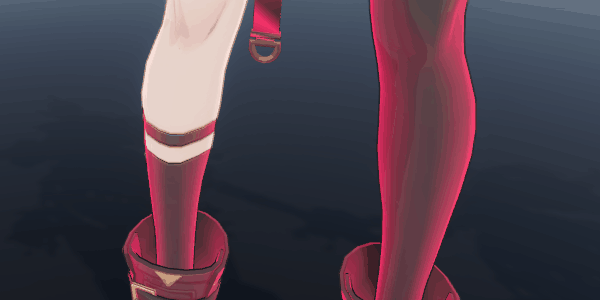

| パラメーター | プロパティ | 説明 |
| :-- | :-- | :-- |
| シェードマスクスイッチ | `_ToggleRimLightShadeMask` → `_RIMLIGHT_SHADEMASK_ON` | シェードマスクを有効にする |
| マスク強度 / マスクオフセット | `_FloatRimLightShadeMaskIntensity` / `_FloatRimLightShadeMaskOffset` | マスクの強度と適用範囲のオフセット |
| シェードカラースイッチ | `_ToggleRimLightShadeColor` → `_RIMLIGHT_SHADEMASK_COLOR_ON` | シェード部分に専用カラーのリムライトを重ねる |
| シェードカラー / 強度 / ハードエッジ | `_ColorRimLightShadeColor` / `_FloatRimLightShadeColorIntensity` / `_ToggleRimLightShadeColorHard` | シェード部分のリムライトのカラー関連の設定 |

#### Mask Map マスクマップ
ベースマップと同じ UV のマスクテクスチャ（R チャンネルをサンプリング）で、リムライトの分布と強度をピクセル単位で制御する。  

| パラメーター | プロパティ | 説明 |
| :-- | :-- | :-- |
| マスクテクスチャ | `_TexRimLightMaskMap` → `_RIMLIGHT_MASKMAP_ON` | リムライト用のマスクテクスチャ（テクスチャを指定すると自動的にキーワードが有効になる） |
| マスク強度 | `_FloatRimLightMaskMapIntensity` | マスクの影響強度（`-1~1`） |

---

### Emissive エミッシブ
`【自发光 Emissive】遮罩、颜色(HDR)、动画`

エミッシブテクスチャで、ライティングの影響を受けない発光色を重ねる。固定の発光とアニメーションする発光（UV スクロール / 回転 / 往復、時間変化カラー、視点変化カラー）に対応する。  

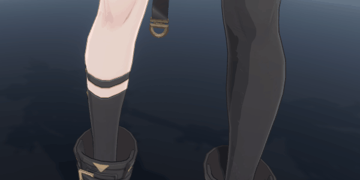

| パラメーター | プロパティ | 説明 |
| :-- | :-- | :-- |
| メインスイッチ | `_ToggleEmissive` → `_EMISSIVE_ON` | エミッシブを有効にする |
| エミッシブテクスチャ | `_TexEmissiveMap` | `RGB` = 発光カラー（sRGB）、`A` = 発光強度（マスク） |
| カラー | `_ColorEmissiveMapColor` | エミッシブのカラー（HDR）。**デフォルトの黒 = 発光しない** |

エミッシブ = `テクスチャRGB × HDRカラー × 強度(テクスチャのAチャンネル)` で、最終カラーへ直接加算される。  

> ⚠ **HDR の発光を見るには Bloom ポストプロセスが必要**：Shader が出力するのはクランプされていない HDR カラーであり、HDR カラーの `Intensity` を上げること自体は明るくするだけである。ブルーム（発光の滲み出し）を得るには、シーンの `Global Volume` で `Bloom` を有効にし、URP Asset で `HDR` にチェックが入っていることを確認する必要がある。  

#### Emissive Animation エミッシブアニメーション
`エミッシブアニメーション-スイッチ` がオフのときは**固定モード**（`テクスチャ × カラー × Aチャンネル` のみ）。オンにすると**アニメーションモード**になり、以下のパラメーターが有効になる。  

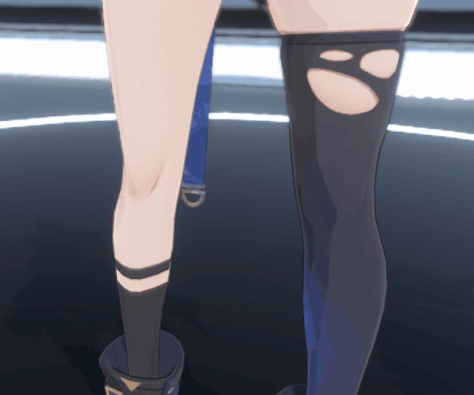

| パラメーター | プロパティ | 説明 |
| :-- | :-- | :-- |
| アニメーションスイッチ | `_ToggleEmissiveAnim` → `_EMISSIVE_ANIM`（キーワードなし = 固定） | オフ = 固定 / オン = アニメーション |
| UVスケールモード | `_FloatEmissiveAnimUVType` | `FullMap` UV 全面マッピング / `MatCap` ビュー空間ノーマルによる球面マッピングで、視点に応じて流れる |
| 移動速度 | `_FloatEmissiveAnimSpeed` | UV のスクロール速度 |
| 移動方向 U / V | `_FloatEmissiveAnimDirU` / `_FloatEmissiveAnimDirV` | UV のスクロール方向 |
| 回転速度 | `_FloatEmissiveAnimRotate` | UV の中心 `(0.5, 0.5)` を軸に回転する |
| 往復移動 | `_ToggleEmissiveAnimPingpong` | `sin` で時間カーブを往復に変える |
| カラー変化 / 変化カラー / 変化速度 | `_ToggleEmissiveChangeColor` / `_ColorEmissiveChangeColor` / `_FloatEmissiveChangeSpeed` | `cos` の時間カーブで、エミッシブのカラーと変化カラーの間を往復して遷移する |
| 視点変化カラー | `_ToggleEmissiveViewChangeColor` / `_ColorEmissiveViewChangeColor` | 視線方向とノーマルのなす角（フレネル）に応じて、エミッシブのカラーとこのカラーの間を遷移する |
| ｜ノーマルマップ | `_ToggleNormalMapOnEmissive` | 視点変化カラーのフレネル計算にノーマルマップを使用する |

> アニメーションモードでは、**カラー**はアニメーションする UV をサンプリングし、**強度（A チャンネル）**は静的な UV をサンプリングする——そのため発光する領域はテクスチャに描いた位置に固定され、その中のカラー/模様だけが流れる。  
> 強度が `0.005` を下回るピクセルは発光しない（`step` の閾値）。これはテクスチャの暗部ノイズによる微かな発光を防ぐためである。  

---

### MatCap マットキャップ
`【材质捕获 MatCap】贴图、混合模式、遮罩`

球面環境マップ（MatCap / Sphere Map）：ワールド空間のノーマルをビュー空間へ変換してサンプリング UV とすることで、視点に依存したマテリアルの質感（金属、玉石、レザーなど）を表現する。実際の反射を計算しなくても豊かな表面表現が得られる。  

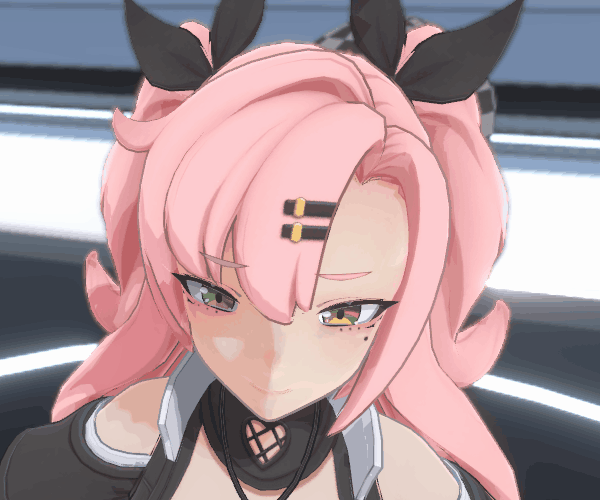

| パラメーター | プロパティ | 説明 |
| :-- | :-- | :-- |
| メインスイッチ | `_ToggleMatCap` → `_MATCAP_ON` | マットキャップを有効にする |
| マットキャップテクスチャ | `_TexMatCapMap` | 球面環境マップ（sRGB）。**デフォルトの黒 = 効果なし** |
| カラー | `_ColorMatCapMapColor` | カスタムカラー（HDR、Alpha も強度に影響する） |
| カラーブレンドモード | `_FloatMatCapColorBlend` → `_MATCAP_COLORBLEND_MULTIPLY` / `_MATCAP_COLORBLEND_LERP`（キーワードなし = Additive） | `Additive` 加算（覆い焼きリニア）/ `Multiply` 乗算（乗算合成）/ `Lerp` 補間ブレンド |
| ブレンド強度 | `_FloatMatCapColorBlendIntensity` | ブレンドモードの強度 |
| 回転 | `_FloatMatCapRotate` | UV の中心を軸に回転する（`-1~1` が `-π~π` に対応） |
| ノーマルマップ | `_ToggleNormalMapOnMatCap` | サンプリングの向きにノーマルマップを使用する |
| シャドウマスク / 強度 | `_ToggleMatCapShadowMask` / `_FloatMatCapShadowMaskIntensity` | シェード1の領域に応じて MatCap を暗くし、影の中で暗くなるようにする |

> MatCap の `ライトカラーの影響を受ける` 設定は `ライト設定 → ライトスイッチ → マットキャップ`（`_ToggleGlobalLightMatCapMap`）で制御する。  

#### Mask Map マスクマップ
ベースマップと同じ UV のマスクテクスチャ（R チャンネルをサンプリング）で、MatCap の分布と強度をピクセル単位で制御する。  

| パラメーター | プロパティ | 説明 |
| :-- | :-- | :-- |
| マスクテクスチャ | `_TexMatCapMaskMap` | マスクテクスチャ（デフォルトの白 = 全面表示。常にサンプリングされるためキーワードは不要） |
| マスク強度 | `_FloatMatCapMaskMapIntensity` | マスクの**オフセット量**（`-1~1`）：マスク値に加算してから `saturate` する。`0` ならテクスチャの値そのまま、正の値で全体的に強く、負の値で全体的に弱くなる |

---

### Light Setting ライト設定
`【光照设置 LightSetting】光照开关、光照强度`

リアルタイムライト、環境光、露出、追加ライト、項目ごとのライトスイッチ、シャドウ、内蔵ライト、ライト方向ロックといった設定を統合している。  

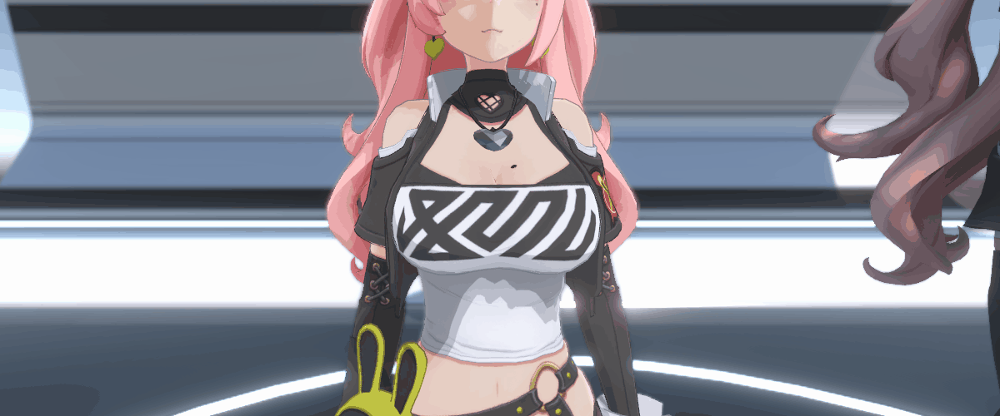

**ライト強度**

| パラメーター | プロパティ | 説明 |
| :-- | :-- | :-- |
| リアルタイムライト強度 | `_FloatRealtimeLightIntensity` | 主光源の強度 |
| 環境光強度 | `_FloatEnvLightIntensity` | 環境光/ライトプローブの強度 |

**露出設定**

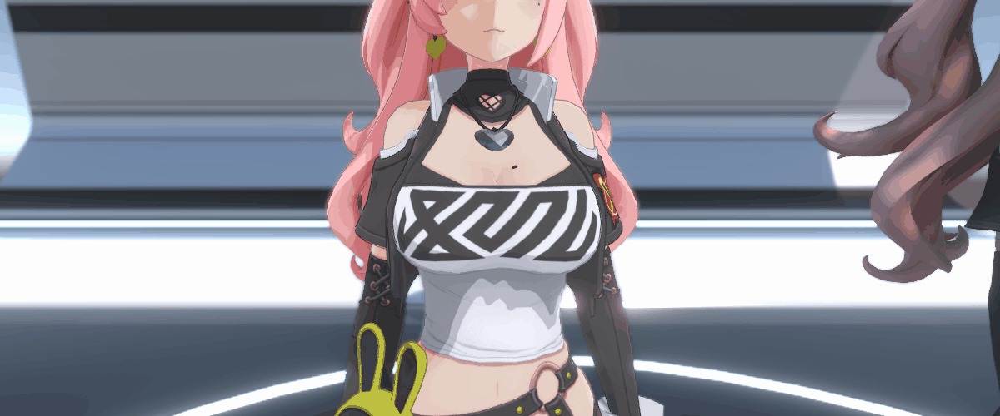

| パラメーター | プロパティ | 説明 |
| :-- | :-- | :-- |
| グローバル露出強度 | `_FloatGlobalExposureIntensity` | 全体の露出 |
| ベースマップ明部の露出 | `_FloatBaseMapExposureIntensity` | 明部の露出 |
| ベースマップシェード1の露出 | `_FloatBaseMapShade1ExposureIntensity` | シェード1の露出 |
| ベースマップシェード2の露出 | `_FloatBaseMapShade2ExposureIntensity` | シェード2の露出 |

**追加ライト（ポイントライトなど）**

| パラメーター | プロパティ | 説明 |
| :-- | :-- | :-- |
| メインスイッチ | `_ToggleAddLight` → `_ADDLIGHT_ON` | 追加ライト（ポイントライト/スポットライト）を有効にする |
| 強度 | `_FloatAddLightIntensity` | 追加ライトの強度。各ライト自身の方向でハーフランバートの方向シェーディングを行い（正面は明るく、逆光側は暗く）、そこへ `ライトカラー × 距離減衰` を加算することで、全体が一様に白くなるのを防いでいる |

**ライトスイッチ（項目ごとのライトの影響）**

以下の項目について、ライトカラーの影響を受けるかどうかを個別に設定できる：  

| 項目 | スイッチのプロパティ | ブレンド強度のプロパティ |
| :-- | :-- | :-- |
| ベースマップ | `_ToggleGlobalLightBaseMap` | `_GlobalLightBaseMapMixedIntensity` |
| シェードマップ1 | `_ToggleGlobalLightBaseShade1` | `_GlobalLightBaseShade1MixedIntensity` |
| シェードマップ2 | `_ToggleGlobalLightBaseShade2` | `_GlobalLightBaseShade2MixedIntensity` |
| ハイライト | `_ToggleGlobalLightHighLight` | —（単純なスイッチのみ、ブレンド強度なし） |
| リムライト | `_ToggleGlobalLightRimLight` | `_GlobalLightRimLightMixedIntensity` |
| シェードリムライト | `_ToggleGlobalLightRimLightShade` | `_GlobalLightRimLightShadeMixedIntensity` |
| アウトライン | `_ToggleGlobalLightOutline` | `_GlobalLightOutlineMixedIntensity` |
| マットキャップ | `_ToggleGlobalLightMatCapMap` | —（単純なスイッチのみ、ブレンド強度なし） |

このうち `アウトライン` は、アウトラインを主光源のカラーに追従させ、落ち影に合わせて一緒に暗くする。  

**シャドウ設定**

| パラメーター | プロパティ | 説明 |
| :-- | :-- | :-- |
| シャドウ投射 | `ShadowCaster` Pass のスイッチ（`Material.SetShaderPassEnabled("ShadowCaster", ...)`。対応するマテリアルプロパティはなし） | シーンへ影を落とす。アルファクリップが有効な場合、くり抜かれた箇所は影を落とさない |
| シャドウ受け / 強度 | `_ToggleShadowReceive` / `_FloatShadowIntensity` | シーンから落ちてくる実際の影を受け取る。強度はシャドウ減衰のオフセット量（負の値で影を明るく/柔らかく、正の値で濃くする） |
| 境界のソフト化 / ソフト化値 | `_ToggleShadowTerminatorSmooth` / `_FloatShadowTerminatorSmooth` | 明暗境界のジャギーを処理する。下記の説明を参照 |
| セルフシャドウのバイアス : 深度バイアス | `_FloatSelfShadowDepthBias` | 投射時にライト方向へ caster を押し出す。大きくするとシャドウアクネ（Shadow Acne）を軽減できる |
| セルフシャドウのバイアス : ノーマルバイアス | `_FloatSelfShadowNormalBias` | 投射時にノーマル方向へ内側に縮め、`1-NdotL` の傾斜に応じてスケールする（グレージング角で最も強い）。大きくすると明暗境界の崩れを抑えられる |
| 低品質PCF | `_ToggleShadowLowQualityPCF` | 主光源のシャドウを低品質（4-tap）の PCF カーネルで強制的に再サンプリングし、キャラクタースケールで生じるシャドウのパースによるジャギーを軽減する |

`境界のソフト化` は、明暗の境界にシャドウマップの解像度由来のジャギーが露出する問題を解決するためのものである：  

| モード | 挙動 |
| :-- | :-- |
| オフ（デフォルト） | シャドウマップをそのまま使用する（元の挙動）。落ち影は境界を含む全領域をカバーするが、境界にシャドウマップの解像度に起因するジャギーが出ることがある |
| オン | `ジオメトリ(NdotL)による滑らかなセルフシャドウのエンベロープ` と `シャドウマップ` の**より暗い方(min)** を取って合成する。単調な 2 本のカーブの min もまた単調であるため、**明るい隙間が生じることは決してない**。境界は滑らかなジオメトリが主導し（ジャギーを解消）、より暗い落ち影はそのまま突き抜け、逆光側も通常どおり暗くなる |

> `ソフト化値` はジオメトリによる滑らかなセルフシャドウのエンベロープの遷移半幅である：大きいほど境界が滑らかになり（ジオメトリ主導の範囲が広がる）、小さいほど境界が鋭くなり、落ち影が境界に近づく。  
> 主光源シャドウのキーワード `_MAIN_LIGHT_SHADOWS*` に依存する（`ForwardLit` と `Outline` Pass の両方に追加済み）。本体とアウトラインが実際の落ち影を受け取るには、URP Asset で主光源シャドウを有効にする必要がある。

`セルフシャドウのバイアス` と `低品質PCF` は、URP のグローバル設定に上乗せする**マテリアル単位の補正**であり、デフォルト値はいずれも「元の挙動を変えない」。問題が出やすい一部のモデルだけを個別に調整するためのものである：  

| 項目 | デフォルト | 説明 |
| :-- | :-- | :-- |
| セルフシャドウのバイアス（深度 / ノーマル） | `0 / 0` = 追加のバイアスなし | URP のグローバルなシャドウ Bias に上乗せする形で、`ShadowCaster` Pass 内で頂点を押し出す。深度バイアスが大きすぎると光漏れ（Peter-Panning）が起きる。ノーマルバイアスは傾斜に応じてスケールし、主に境界の崩れを抑える。スライダーの `[0,1]` は約 `0~0.02` ワールド単位に対応し、キャラクタースケールで使いやすい範囲に収まっている |
| 低品質PCF | `オフ` = URP 標準のサンプリングを使用 | Medium/High の広いカーネルの PCF はサンプリングをより広いシャドウマップ領域へ広げるため、キャラクタースケールのパース下ではかえってテクセルの階段が強調される。低品質カーネルの方がキャラクターに適しており、エッジも綺麗になる。**シャドウマップ**経路でのみ有効であり、スクリーンスペースシャドウ（`_MAIN_LIGHT_SHADOWS_SCREEN`）およびシャドウ無しの場合はデフォルトのサンプリングにフォールバックする |

> ⚠ `低品質PCF` を使うには URP Asset で `Soft Shadows` にチェックを入れる必要がある——4-tap のテクセルオフセットはソフトシャドウが有効なときにのみパイプラインから送られるため、そうでないと 4 つのサンプリング点が重なってハードシャドウと同じになり、このスイッチには目に見える効果がなくなる。  
> 実装は `Core/Shaders/ShadowFunction.hlsl` の `MainLightShadowLowQualityPCF` を参照。  

**内蔵ライト（マテリアル専用）**

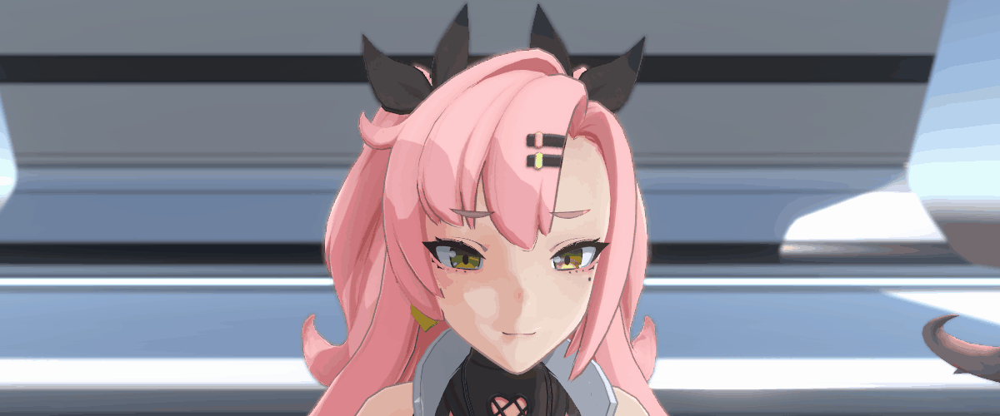

有効にするとマテリアル自身が持つライト方向とカラーを取り込み、キャラクターが異なるシーンでも一貫した固定のライティングを保てるようになる。  

ただし、どちらも**ブレンド**であってシーンのライトを直接置き換えるものではない点に注意：ライト方向は `方向ブレンド強度` に従って「シーンのライト方向 ↔ 内蔵ライト方向」の間で補間される（デフォルト 0.5 = 半々）。ライトカラーは追加で `内蔵ライトカラースイッチ` を有効にして初めてブレンドに参加し、そうでなければシーンのライトカラーをそのまま使う。シーンのライト方向から完全に切り離すには、`方向ブレンド強度` を 1 にする必要がある。  

| パラメーター | プロパティ | 説明 |
| :-- | :-- | :-- |
| 内蔵ライトスイッチ | `_ToggleBuiltInLight` → `_BUILTINLIGHT_ON` | 内蔵ライトを有効にする |
| 方向 X / Y / Z | `_FloatBuiltInLightAxisX/Y/Z` | 内蔵ライトの方向 |
| 方向ブレンド強度 | `_FloatBuiltInLightDirBlend` | 0=シーンのライト方向、1=内蔵ライトの方向 |
| 内蔵ライトカラースイッチ / カラー / ブレンド強度 | `_ToggleBuiltInLightColor` / `_ColorBuiltInLightColor` / `_FloatBuiltInLightColorBlend` | 内蔵ライト専用のカラー |

**ライト方向ロック**

ライトの高さを水平にロックし、明暗が水平軸方向に沿って変化するようにする。以下の項目それぞれに適用できる：  

| 項目 | プロパティ |
| :-- | :-- |
| ベースマップ | `_ToggleLightHorLockBaseMap` |
| ハイライト | `_ToggleLightHorLockHighLight` |
| リムライトのシェードマスク | `_ToggleLightHorLockRimLight` |

---

### レンダリング Pass の説明
`ForwardLit`（基本ライティング）と `Outline`（アウトライン）のほかに以下の Pass を含んでおり、URP の完全なレンダリングフローの中でオブジェクトが正しく動作することを保証している：

| Pass | LightMode | 役割 |
| :-- | :-- | :-- |
| `ShadowCaster` | `ShadowCaster` | シーンへ影を落とす（「シャドウ設定 → シャドウ投射」のスイッチで制御）。ポイントライト/スポットライトの頂点単位のライト方向とアルファクリップに対応する |
| `DepthOnly` | `DepthOnly` | カメラの深度テクスチャ `_CameraDepthTexture` へ書き込み、深度フォグ、ソフトパーティクル、スクリーンスペースのアウトラインなどで利用される |
| `DepthNormals` | `DepthNormals` | カメラのノーマルテクスチャ `_CameraNormalsTexture` へ書き込み、SSAO などノーマルに依存するポストプロセスで利用される |

各 Pass のレンダリングステート一覧：

| Pass | Cull | アルファクリップ | クリップ Clip | ステンシルテスト |
| :-- | :-- | :--: | :--: | :--: |
| `ForwardLit` | `[_IntRenderFaceType]` | ✅ | ✅ | ✅ |
| `Outline` | `Front`（固定） | ✅ | ✅（ハードなカリング） | ✅ |
| `ShadowCaster` | `[_IntRenderFaceType]` | ✅ | ❌ | ❌ |
| `DepthOnly` | `[_IntRenderFaceType]` | ✅ | ❌ | ❌ |
| `DepthNormals` | `[_IntRenderFaceType]` | ✅ | ❌ | ❌ |

> 3 つの追加 Pass はいずれもアルファクリップ（`_ALPHATEST_ON`）に対応しており、くり抜かれたオブジェクトの影と、深度/ノーマルの輪郭が本体と一致する。  

---

### Debug デバッグ
`【调试 Debug】仅编辑器用，不影响正式流程`

Inspector の**最上部**にあるデバッグ機能の領域。`ハイライト表示（Scene）` を有効にすると、Scene ビュー内で現在のマテリアルを使用しているすべてのオブジェクトが**マゼンタの塗りつぶし**で重ね描画され（遮蔽を貫通して見える）、バウンディングボックスのワイヤーフレームと名前ラベルも描画される。複雑なシーンでもそのマテリアルがどこで使われているかをすばやく特定できる。  

- **サブメッシュ**単位で正確に判定：同一オブジェクト上の異なるマテリアルスロットのうち、実際に現在のマテリアルを使っている部分だけをハイライトする（顔の肌 vs 目、など）。
- `SkinnedMeshRenderer` に対応（現在のポーズでメッシュをベイクする）。
- 純粋なエディター機能：マテリアル/Shader/レンダーパイプラインを変更せず、Scene ビューに重ねて描画するだけなので、Game ビューや実際の実行フローには影響しない。
- スイッチはエディターのセッション単位の状態であり、マテリアルには書き込まれない。スクリプトの再コンパイル/ドメインリロード後は自動的にオフになる。

ソースコード：`Assets/PluginsDeveloper/BlurToonURP/Core/Editor/MaterialDebugHighlight.cs`

---

### Tools ツール
| スクリプト | 説明 |
| :-- | :-- |
| `LightController.cs` | ライトにアタッチすると、設定したオイラー角の速度でライトを自動回転させられる（遅延開始、継続時間にも対応）。効果のデモや録画によく使う。 |

---
